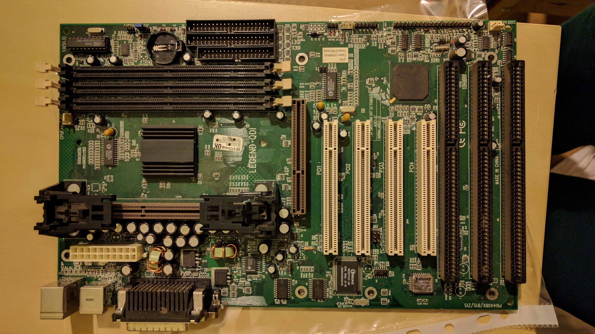

# 386

## 386 DX
* Am386 DX-40
* chipset OPTi
* 5x ISA 16 bit, 1x ISA 8 bit 
* no battery
* **SIMM x4 inserted**

### Storage & status
* status: unknown
* stored in: 386, 486 box

# Socket 3 (486 class)

## ICL Socket 3
* integra ATI Mach64 and IDE controller
* chipset OPTi
* no BIOS
* atypical (?) power supply connector
* with "riser" ISA/PCI slots
* came with 486 DX2
* hard to Google

### Storage & status
* status: untested
* stored in: Delicje box

## Chaintech 486SLE (4SLE2-G1)
  

* no ide controller
* 1x ISA 8 bit, ISA 16 bit, 2x VLB
* chipset SIS 85C471

### Storage & status
* status: CPU warm, all voltages nominal, won't "beep" and boot, removing EEPROM makes no difference
* **stored in: 386, 486 box**

## 486 Socket 3 no labels
* no ide controller
* ISA 16 bit, 3x VLB
* chipset UMC UM848F
* SIMM 30 pin, SIMM 72 pin

### Storage & status
* **stored in: 386, 486 box**

# Socket 7 (klasy Pentium)

## Gainward 5VPA REV 1.1

* AT ATX

### Storage & status
* **stored in: ECS box**

## Gigabyte GA-586ATV
* stan nieznany
* AT
* Intel VX
* https://www.gigabyte.com/Motherboard/GA-586ATV

### Storage & status
* **stored in: Delicje box**

# Slot 1 (Pentium II class)

## Intel SR440BX
* Riva TNT integrated

### Storage & status
* 100% working
* **in use in PII machine**

## QDI Legend
 
* Intel BX

### Storage & status
* status: sometimes boots untile beep, once booted to graphics card bios, but mostly nothing happens
* tested with PII 400 i Expertcolor S3 Virge
* inserted new battery for testing
* **stored in: Delicje box**

## Compaq Slot 1

### Storage & status
* status: unknown
* stored in: Delicje box
